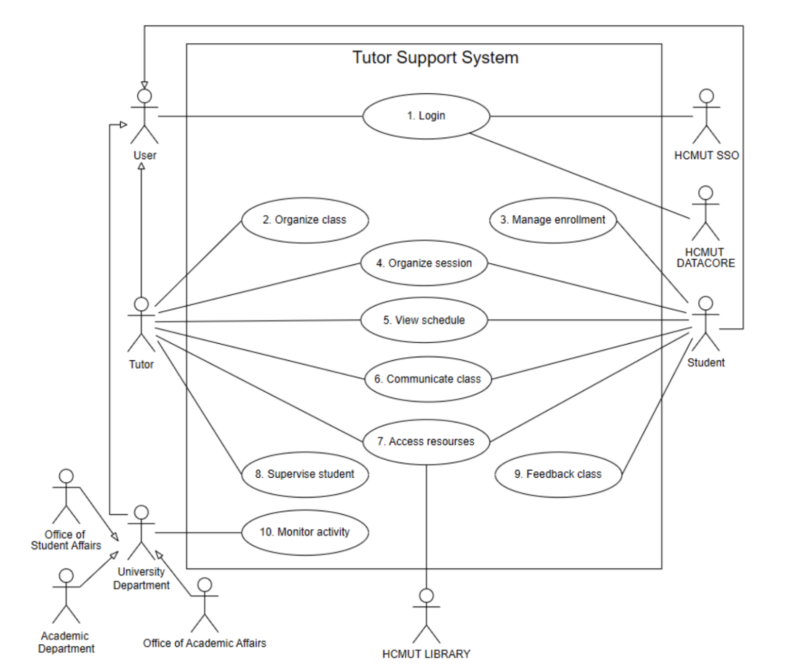

# 🎓 Tutor Support System  
### SOFTWARE ENGINEERING (CO3001) — Assignment  
### Ho Chi Minh City University of Technology – VNU-HCM (HCMUT)

---

## 📌 Project Overview

The **Tutor Support System** is a proposed web-based platform designed to digitalize and centralize the management of the Tutor/Mentor program at HCMUT.

Currently, tutoring activities are handled through fragmented manual processes, leading to inefficiencies in registration, scheduling, communication, and reporting. This system aims to solve these issues by providing a unified digital solution for students, tutors, and university departments.

> ⚠️ This project is a **UI Mockup Prototype only** (no backend implementation).  
Built using **React, Tailwind CSS, and shadcn/ui** to demonstrate system workflows and user experience.


---

## 🎯 Objectives

- Digitize tutoring workflows (registration, scheduling, communication)
- Support tutors in managing subject-based classes
- Allow students to register, request, and participate in tutoring sessions
- Enable session scheduling and rescheduling with validation rules
- Provide feedback and reporting mechanisms
- Simulate integration with HCMUT internal systems:
  - HCMUT_SSO (authentication)
  - HCMUT_DATACORE (user data)
  - HCMUT_LIBRARY (learning resources)

---

## 👥 Stakeholders

### 🎓 Students
- Register for tutoring classes
- Join or request new classes
- View schedules and notifications
- Access learning materials
- Participate in discussions and feedback

### 👨‍🏫 Tutors
- Create and manage classes and sessions
- Approve/reject student registrations
- Track attendance and student progress
- Share learning materials
- Receive feedback and notifications

### 🏢 Academic Department
- Monitor tutoring activities
- Evaluate tutor performance
- Review class reports and participation

### 🏛 Office of Academic Affairs
- Analyze tutoring effectiveness
- Generate academic impact reports
- Support data-driven decision making

### 🧑‍💼 Office of Student Affairs
- Track student participation
- Support training credit and scholarship evaluation

---

## 🧩 System Modules

### 1. Tutor Organize Class Module
- Create and manage tutoring classes
- Configure class capacity and schedules
- Synchronization with HCMUT_DATACORE (mocked)

### 2. Student Enrollment Module
- Search and filter classes
- Register or request new classes
- Handle approval workflows (UI mock only)

### 3. Learning & Report Management Module
- Class discussion system (posts/comments)
- File and learning resource sharing
- Attendance & progress tracking UI
- Feedback submission system
- Report dashboards (mock)

### 4. Session Management Module
- Create and update schedules
- Rescheduling rules (e.g., 3-day advance requirement)
- Conflict checking (UI simulation)
- Notifications for all session updates
- Make-up session handling

---

## ⭐ Major Features

### 👨‍🎓 Students
- Search & filter tutoring classes
- Register / cancel class enrollment
- Create and join class requests
- View schedules & notifications
- Access class materials
- Create/delete posts & comments
- Receive notifications for activity updates
- Provide anonymous feedback
- Confirm rescheduled sessions
- Language switching (UI mock)

---

### 👨‍🏫 Tutors
- Create / update / delete classes
- Approve or reject student registrations
- Manage session schedules
- View student progress (mock data)
- Track attendance (UI only)
- Post and comment in class forum
- Receive notifications for new activity
- Review feedback for improvement

---

### 🏢 Academic Department
- Monitor class operations
- Track student participation
- Evaluate tutor performance
- View class request reports
- Access analytics dashboard (mock UI)

---

### 🏛 Academic & Student Affairs
- View tutoring reports and statistics
- Track student participation history
- Support training credit evaluation
- Analyze tutoring effectiveness (manual interpretation)

---

## 🚫 Out of Scope

This project does NOT include:

- Automatic tutor assignment
- Attendance verification (biometric / auto check-in)
- GPA or academic transcript management
- Payment or salary processing
- AI-based learning analytics
- Full curriculum/course management
- Quiz / exam / assignment system
- Integration with external LMS (Moodle, Teams, Zoom, etc.)
- Automated AI feedback analysis

---

## 🛠 Tech Stack

- **Frontend:** React.js (Vite)
- **Styling:** Tailwind CSS
- **UI Library:** shadcn/ui
- **State Management:** React Hooks (useState, useContext)
- **Routing:** React Router (if needed)

## 📁 Project Structure

```text
src/
│
├── components/       # Reusable UI components (buttons, cards, navbar)
├── pages/            # Main pages (Student / Tutor / Admin)
├── layouts/          # Layout wrappers (dashboard, auth layout)
├── mocks/            # Fake data (classes, users, sessions)
├── assets/           # Images, icons
├── routes/           # Route definitions
└── App.jsx           # Main entry
```

---

## 🚀 Getting Started

### 1. Install dependencies
```bash
npm install
```

### 2. Run development server
```bash
npm run dev
```

### 3. Open application
```text
http://localhost:5173
```

---

## 🎨 UI Design Notes

* **Clean dashboard-style interface**
* **Role-based UI** (Student / Tutor / Department / Admin)
* **Fully responsive** (desktop + mobile)
* **Mock data** simulates real system behavior
* All workflows are **frontend-only demonstrations**

---

## 📊 System Vision

This system aims to improve:

* 📈 Academic support efficiency
* 🤝 Tutor–student collaboration
* 📚 Learning resource accessibility
* 🧾 Administrative transparency
* 📊 Data-driven education decisions

---

## 👨‍💻 Authors

* **Nguyễn Nhật Nam**
* **Tô Nhã Vy**